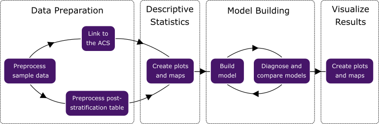

## Overview

shinymrp is a two-in-one package that offers both a graphical and a programmatic interface for applications for Multilevel Regression and Post-stratification (MRP). They parallel each other in their implementation of the following data analysis workflow that the methodology underlies.



Please follow the instructions below to install the package and its prerequisites.
It is important that Stan is configured properly as it is the engine for all Bayesian modeling in shinymrp.
Once everything is set up, you can either run the Shiny app with `shinymrp::run_app()` or use the exported classes in your R scripts.
Because the app is more user-friendly and has a built-in guide, all the vignettes will focus on the programmatic components.
If you are interested in using the R6 classes, we recommend starting with the overview in the ["Using the exported classes"](https://mrp-interface.github.io/shinymrp/articles/getting-started#using-the-exported-classes) section below.

```{r, eval = FALSE}
shinymrp::run_app()
```

## Installation
Users can install the package from GitHub by running the following R command:

```{r, eval = FALSE}
# install.packages("remotes") # if not already installed
remotes::install_github("mrp-interface/shinymrp")
```

This will install [CmdStanR](https://mc-stan.org/cmdstanr/), a dependency for interfacing with [Stan](https://mc-stan.org/).
Stan is a C++ library for Bayesian modeling that requires a modern C++ compiler and the GNU Make build utility (a.k.a. “gmake”) for compiling Stan programs.
If you are not sure whether your machine has the necessary toolchain, please follow the instructions below to set it up.
Once the toolchain is ready, follow the ["CmdStanR documentation"](https://mc-stan.org/cmdstanr/articles/cmdstanr.html#installing-cmdstan) to install CmdStan and you are all set.

### C++ Toolchain Configuration

#### Linux

On most systems, the GNU Make utility is pre-installed and is the default `make` utility.
There is usually a pre-installed C++ compiler as well, however, it may not be new enough.
To check your machine, run the commands:

```bash
g++ --version
make --version
```

If these are at least at `g++` version 4.9.3 or later and
`make` version 3.81 or later, no additional installations are
necessary. It may still be desirable to update the C++ compiler `g++` because later versions are faster.

A modern C++ compiler and GNU make are bundled into the meta-package `build-essential`,
and can be installed via the command:

```bash
sudo apt-get install build-essential

# then rerun checks
g++ --version
make --version
```

#### Mac

On Mac, the C++ compiler and GNU Make are included with Xcode, the Apple toolset for software developers.
To check if you have the Clang C++ compiler:

```bash
clang --version
```

If this command fails, then install Xcode via the following command

```bash
xcode-select --install
```


#### Windows

For Windows, [RTools](https://cran.r-project.org/bin/windows/Rtools/) is a toolchain bundle that includes the necessary C++ toolchain for compiling Stan programs. Install the appropriate version based on the version of R on your machine.


## Using the exported classes

For experienced users, the programmatic components exported by shinymrp offers more flexibility in exchange for the visual aids that the Shiny app provides. Users can lay out the workflow and run it from start to end with a single R script execution. Moreover, fitting complex statistical models to large datasets can be memory-intensive. The classes allow users to utilize computational resources from high-performance computing clusters, which often offer limited support for graphics.

Below is a minimal example of the typical workflow using the exported classes. Excluding the setup, the following code blocks correspond the four stages in the MRP workflow illustrated above. For a more details about each step in the workflow and the corresponding methods, refer to the ["Programmatic workflow walkthrough"](https://mrp-interface.github.io/shinymrp/articles/workflow.html) vignette.

The process always starts with importing the package components and create a new workflow object with the `mrp_workflow()` function. This `MRPWorkflow` object will help us manage data throughout the process and provides methods for preprocessing, visualization, and creating models. These methods can be accessed using the `$` operator, as you will see throughout the example.

```{r eval=FALSE}
library(shinymrp)

# Initialize the MRP workflow
workflow <- mrp_workflow()

```

In the first stage, we preprocess an example sample data included in the package, then link to the American Community Survey (ACS) to obtain the poststratification data.

```{r eval=FALSE}
# Load example data
sample_data <- example_sample_data()

### DATA PREPARATION

# Preprocess sample data
workflow$preprocess(
  sample_data,
  is_timevar = TRUE,
  is_aggregated = FALSE,
  special_case = NULL,
  family = "binomial"
)

# Link data to the ACS
# and obtain poststratification data
workflow$link_acs(
  link_geo = "zip",
  acs_year = 2021
)
```

Before building models, it is important to explore the data to understand its structure and check for potential issues.
The workflow object provides methods for visualizing data distributions and summary statistics.
Thanks to the object-oriented design, these methods can access the data stored in the workflow object without requiring users to input them again.

```{r eval=FALSE}
### DESCRIPTIVE STATISTICS

# Visualize demographic distribution of data
workflow$demo_bars(demo = "sex")

# Visualize geographic distribution of data
workflow$sample_size_map()

# Visualize outcome measure
workflow$outcome_plot()
```

The `$create_model()` method allows users to define and instantiate new model objects within the workflow.
These `MRPModel` objects encapsulate the model specification and provide methods for fitting the model, summarizing results, and presenting diagnostics.
We can use the `$pp_check()` method from the workflow object to assess how well the fitted model can replicate the observed data.

```{r eval=FALSE}
### MODEL BUILDING

# Create new model objects
model <- workflow$create_model(
  model_spec = list(
    Intercept = list(
      Intercept = ""
    ),
    fixed = list(
      sex = "",
      race = ""
    ),
    varying = list(
      age = "",
      time = ""
    )
  )
)

# Run MCMC
model$fit(n_iter = 1000, n_chains = 2, seed = 123)

# Estimates summary and diagnostics
model$summary()

# Sampling diagnostics
model$diagnostics()

# Posterior predictive check
workflow$pp_check(model)
```

Finally, the workflow object provides visualization methods to present the results of the fitted models,
including overall estimates and estimates for demographic groups or geographic areas. For geography-based results,
users have the option to visualize the values on an interactive choropleth map.

```{r eval=FALSE}
### VISUALIZE RESULTS

# Plots of overall estimates, estimates for demographic groups and geographic areas
workflow$estimate_plot(model, group = "sex")

# Choropleth map of estimates for geographic areas
workflow$estimate_map(model, geo = "county")

```
