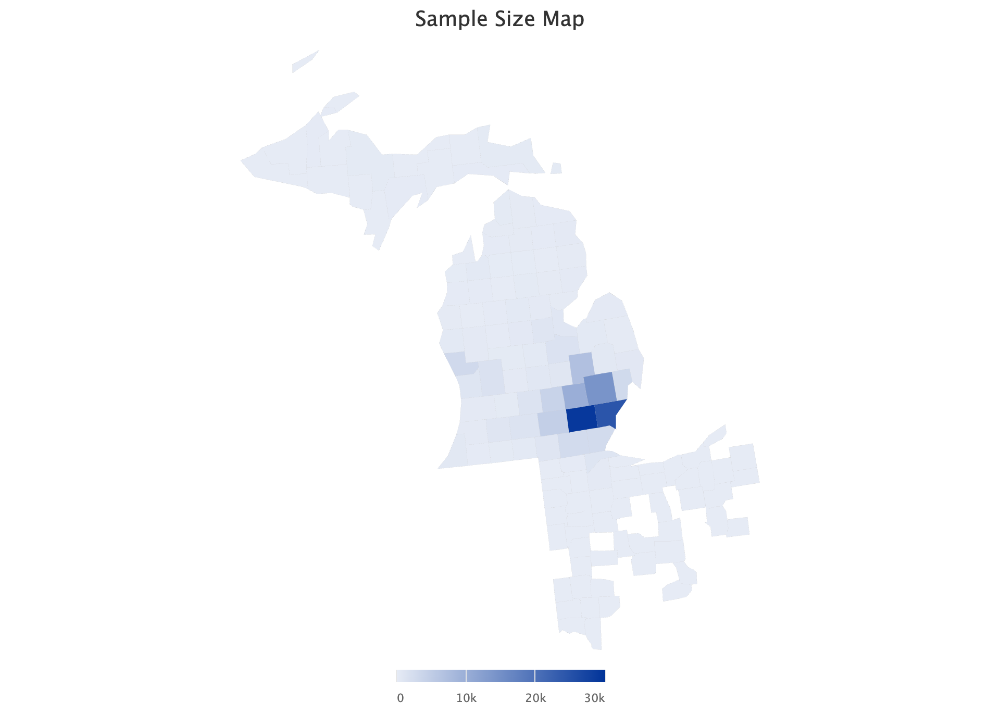

```{r, include = FALSE}
knitr::opts_chunk$set(
  collapse = TRUE,
  comment = "#>"
)
```

To account for spatial correlation between geographic measures, the interface implements two widely used versions of the Conditional Autoregressive (CAR) models as prior specifications within the Bayesian hierarchical models:

1. Intrinsic CAR (**ICAR**): An intrinsic (improper) Gaussian Markov random field that smooths geospatial estimates by penalizing differences between neighbors.
2. Besag-York-Mollié-2 (**BYM2**): A reparameterization of the BYM  model that combines a structured ICAR component with a spatially independent component and incorporates scaling to standardize interpretation across multiple graphs.

This vignette provides a brief description of the spatial priors and corresponding Stan code. We also include the case study applying the BYM2 prior to a hierarchical model for COVID-19 infection estimation. 


## 1. Areal data & neighborhood graph

These models specifically apply to *areal data*, which consist of a single aggregated measure for each areal unit or region. In spatial modeling, the primary interest lies in the **relationships between units** rather than in the units themselves. Common approaches to defining these relationships include **rook** and **queen contiguity**, which identify two areal units as neighbors if they share a border (or a vertex). We use the `spdep` package to construct neighborhood graphs from areal units. For ZIP codes, **ZCTAs** (ZIP Code Tabulation Areas) are used as proxies to infer the adjacency structure. A common mathematical representation of this structure is via the **adjacency matrix**, denoted \( \mathbf{W} \). Because the edges are undirected, \( \mathbf{W} \) is a symmetric \( N \times N \) matrix for a set of \( N \) areal units. This representation enables mathematical operations that yield valuable insights into the neighborhood graph.

The **connectivity** of the graph can affect the choice of spatial models. For instance, the ICAR prior requires a connected graph. A **connected** graph contains a single **component**, meaning that each node can be reached from any other node. In contrast, a graph with multiple components is **disconnected**, as nodes in one component cannot reach those in another. A component of size one is referred to as an **island** (or **isolate**). Since the structured component of a spatial model relies on neighborhood edges for smoothing, these isolates require special handling. 

## 2. Intrinsic Conditional Auto-Regressive (ICAR) models

The **ICAR model** is a special case of a Gaussian Markov random field (GMRF), known as the intrinsic GMRF. Let \( \pmb{\phi} = \left(\phi_1, \ldots, \phi_N\right)^{\top} \) denote the spatial random effects associated with the $N$ neighboring regions. Assuming that spatial dependence is fully captured by the neighborhood structure in $\mathbf{W}$, the ICAR model assumes that each $\phi_i$ is conditionally distributed based its neighboring values $\phi_{-i}$: 
\[
(\phi_i \mid \phi_{-i}) \sim {N}\!\left(
  \frac{\sum_j w_{ij}\phi_j}{\sum_j w_{ij}},
  \frac{1}{\tau \sum_j w_{ij}}
\right),
\]
where $w_{ij} > 0$ if nodes $i$ and $j$ are neighbors and $w_{ij} = 0$ otherwise, and $\tau$ represents the precision. Thus, the joint density can be written as 

\[ p(\pmb{\phi} \mid \tau ) \propto \tau^{\frac{N-1}{2}}\exp \left(-\frac{\tau}{2} \pmb{\phi}^{\top} \mathbf{L} \pmb{\phi}\right), \]

where \( \mathbf{L} = \mathbf{D} - \mathbf{W} \) is the **graph Laplacian matrix**, constructed from the adjacency matrix $\mathbf{W}$ and the degree matrix $\mathbf{D}$, where $\mathbf{D} = \text{diag}(d_i)$ with $d_i = \sum_j w_{ij}$. Note that $\mathbf{L}$ satisfies $\mathbf{L} \mathbf{1}=\mathbf{0}$, and is positive semidefinite but not invertible. Expanding the quadratic form, we can express the log-probability density in terms of pairwise differences between neighboring pairs:  

\[ \log p(\pmb{\phi}) = -\frac{\tau}{2} \sum_{i \sim j} w_{ij} (\phi_i - \phi_j)^2 + \text{const.}, \]

where ${i \sim j}$ means that $i$ and $j$ are neighbors. The joint density is improper but characterizes local conditional relationships among neighboring sites, penaling large differences between neighbors and thus encouraging local smoothness. The precision parameter $\tau$ controls the degree of smoothness captured by the ICAR component. This formulation explicitly shows how the neighborhood structure is incorporated into the joint probability. It also reveals the **unidentifiability problem** of the ICAR model, because adding a constant to all elements of \( \pmb{\phi} \) does not change the differences. To resolve this, a **sum-to-zero constraint** is imposed: 
\[ \sum_{i=1}^{N} \phi_i = 0. \] 
This constraint also prevents \( \pmb{\phi} \) from confounding the model intercept.

### 2.1 Stan implementation

The implementation in Stan is straightforward with the pairwise difference formulation.

Define the function for computing the log probability density:

``` stan
functions { 
  real icar_normal_lpdf(vector phi, array[] int node1, array[] int node2) {
    return -0.5 * dot_self(phi[node1] - phi[node2]);
  }
  ...
```

Pass neighborhood information using edges defined by node indices:

``` stan
data {
  int<lower = 0> N;  // number of areal regions
  int<lower = 0> N_edges;  // number of neighbor pairs
  array[N_edges] int<lower = 1, upper = N> node1; // neighbor pairs: node1[i] adjacent to node2[i]
  array[N_edges] int<lower = 1, upper = N> node2;
  ...
```

Constrain \(\phi\) using Stan’s `sum_to_zero_vector` definition:

``` stan
parameters {
  sum_to_zero_vector[N] phi; // structured spatial random effects
  ...
```

Specify the joint probability density:

``` stan
model {
  phi ~ icar_normal(node1, node2);
  ...
```

## 3. BYM2 model

While the ICAR prior imposes spatial dependence, it can be overly restrictive in practice. By construction, all variation in $\pmb{\phi}$ is spatially structured, so independent region-specific deviations are absorbed into the smooth surface. In many real data applications, however, some variability is spatially uncorrelated (e.g., due to measurement error or region-specific effects). To address this, the Besag–York–Mollié (BYM) model augments the ICAR component with an unstructured random effect that captures independent noise. The BYM2 reparameterization (Riebler et al., 2016) refines this approach by standardizing the ICAR term and separating overall scale from the spatial structure. In effect, the precision parameter $\tau$ from the ICAR model is replaced by a fixed scaling constant derived from the neighborhood graph, ensuring that the total variance and spatial proportion parameters remain interpretable and comparable across datasets.

In the BYM2 formulation, the ICAR precision matrix is rescaled by \(s\), computed from the graph Laplacian \(\mathbf{L}\) as

\[
s = \operatorname{mean}\!\big[\mathrm{diag}(\mathbf{L}^{-}_{\text{pseudo}})\big],
\]

where \(\mathbf{L}^{-}_{\text{pseudo}}\) denotes the Moore–Penrose inverse of the Laplacian. This ensures that the scaled ICAR component \(\pmb{\phi}^\ast = s^{-1/2}\pmb{\phi}\) has unit marginal variance under the graph structure, i.e., \(\operatorname{Var}(\phi_i^\ast) = 1\).

The spatial random effect for region \(i\) is then modeled as

\[
a_i = \sigma\,b_i
= \sigma\!\left(
  \sqrt{\rho}\,\phi_i^\ast
  + \sqrt{1-\rho}\,\theta_i
\right) = \sigma\!\left(
  \sqrt{\frac{\rho}{s}}\,\phi_i
  + \sqrt{1-\rho}\,\theta_i
\right),
\qquad i = 1, \dots, N,
\]

where:

- \(\phi_i^\ast\) is the *scaled* ICAR component, standardized such that \(\operatorname{Var}(\phi_i^\ast) = 1\);
- \(\theta_i \sim \mathbf{N}(0,1)\) is the unstructured (independent) term;
- \(\sigma > 0\) is the overall standard deviation controlling total variability; and
- \(\rho \in [0,1]\) controls the proportion of variation attributed to the structured (ICAR) component.

This formulation removes the precision parameter \(\tau\) from the model by absorbing it into the scaling of the ICAR component. As a result, the parameters \(\sigma\) and \(\rho\) have clear and interpretable meanings: \(\sigma\) represents the total spatial variability, and \(\rho\) quantifies how much variability is explained by the spatial structure.


### 3.1 BYM2 reparameterization for disconnected graphs

The standard BYM2 model assumes that the spatial graph is **connected**, meaning every areal unit can be reached from any other through a path of neighboring edges. When the adjacency graph has **multiple connected components**, the Laplacian matrix \(\mathbf{L}\) becomes block-diagonal, and the ICAR prior exhibits one degree of freedom (a zero eigenvalue) **per component**.   Consequently, the BYM2 formulation must be extended to handle these multiple components. To make the implementation of this extension easier, we reparameterize, at the component level, the structured ICAR field on a basis that (i) lies in each component’s sum-to-zero subspace and (ii) is BYM2-standardized. Isolates receive only the spatially independent part.

Recall that \(W\) is the symmetric adjacency, \(D=\mathrm{diag}(d_i)\) is the degree matrix, and \(L=D-W\) is the graph Laplacian. Because the graph is connected, \(L\mathbf 1=0\) and \(\mathrm{null}(L)=\mathrm{span}\{\mathbf 1\}\). The ICAR prior is improper on \(\mathbb R^N\) but becomes proper on the sum-to-zero subspace
\[
\mathbf H=\{\phi\in\mathbb R^N:\mathbf 1^\top \phi=0\}.
\]
Since \(L\) is symmetric and positive semidefinite, diagonalize \(L=U\Lambda U^\top\), where the eigenvalues satisfy \(0=\lambda_1<\lambda_2\le\cdots\le\lambda_N\), with \(u_1\propto \mathbf 1\). Write \(U_+=[u_2,\ldots,u_N]\in\mathbb R^{N\times(N-1)}\) and \(\Lambda_+=\mathrm{diag}(\lambda_2,\ldots,\lambda_N)\). The Moore–Penrose pseudo inverse is
\[
L^{-}=U_+\Lambda_+^{-1}U_+^\top,
\]
which equals the covariance of the ICAR prior restricted to \(\mathbf H\).

Define the basis
\[
R \;=\; U_+\,\Lambda_+^{-1/2}\in\mathbb R^{N\times(N-1)},\qquad \eta \sim \mathbf N(0,I_{N-1}),\qquad \phi \;=\; R\,\eta.
\]
This reparameterization is equivalent to the constrained ICAR in the following sense. First, the support matches because each column of \(R\) is orthogonal to \(\mathbf 1\), hence \(\mathbf 1^\top\phi=\mathbf 1^\top R\eta=0\) for all \(\eta\), i.e., \(\phi\in\mathbf H\). Second, the mean matches since \(\mathbb E[\phi]=R\,\mathbb E[\eta]=0\). Third, the covariance matches because
\[
\mathrm{Var}(\phi) \;=\; R\,\mathrm{Var}(\eta)\,R^\top \;=\; R R^\top \;=\; U_+\Lambda_+^{-1}U_+^\top \;=\; L^{-}.
\]
Linear images of a multivariate normal are normal; therefore \(\phi\stackrel{d}{=}\mathbf N(0,L^{-})\) on \(\mathbf H\). Right-orthogonal rotations of the scores, \(R\mapsto RQ\) with \(Q\) orthogonal, leave \(R R^\top\) unchanged; the parameterization is not unique but the induced law for \(\phi\) is.

BYM2 standardization rescales the structured field so that the geometric mean (GM) of its marginal variances equals one. Let \(v_i=(L^{-})_{ii}\) and define
\[
s \;=\; \exp\Big(\tfrac{1}{N}\sum_{i=1}^N \log v_i\Big),\qquad R_{\text{BYM2}} \;=\; \frac{1}{\sqrt{s}}\,R,\qquad \tilde\phi \;=\; R_{\text{BYM2}}\,\eta.
\]
Then \(\mathrm{GM}\big(\operatorname{diag}\mathrm{Var}(\tilde\phi)\big)=1\), while \(\mathbf 1^\top \tilde\phi=0\) still holds because the subspace is unchanged.


### 3.2 Stan implementation for both connected and disconnected graphs

The reparameterization allows a clean implementation as the reduced-rank ICAR basis is already BYM2-standardized and enforces the sum-to-zero constraint by construction. The sum_to_zero vector is not longer needed that can improve sampling.

Pass the scaled reduced-rank ICAR basis:

``` stan
data {
  int<lower=0> N;  // number of areal regions
  int<lower=0> N_pos; //number of positive eigenvalues
  matrix[N_zip, N_pos] R; // scaled so that geometric mean of
                          // marginal variance is 1
  ...

```
Define parameters:

``` stan
parameters {
  real<lower=0> sigma; // overall standard deviation for spatial effect
  real<lower=0, upper=1> rho; // mixing parameter 
  vector[N] theta; // unstructured spatial random effect
  vector[N] eta; // structured reduced-rank scores
  ...
```

Compute the scaled ICAR component and combined spatial effect:

``` stan
transformed_parameters {
  vector[N] phi = R * eta;
  vector[N] b = sqrt(rho) * phi + sqrt(1 - rho) * theta;
  vector[N] a = sigma * b
  ...
```

Assigning priors:

``` stan
model {
  theta ~ std_normal();
  phi ~ icar_normal(node1, node2);
  rho ~ uniform(0, 1); //can be ignored since this is the default prior
  sigma ~ normal(0, 3);
  ...
```

## 4. Case study: COVID infection estimation

One common application of the BYM2 model is infectious disease surveillance. Here, we fit a multilevel regression model to a dataset containing COVID-19 test records from a Midwest hospital. This dataset includes over 120,000 test records from patients residing in more than 1,000 ZIP codes, with most records from Michigan and more than a quarter of the ZIP codes having five or fewer test records. 

<!-- ```{r, echo=FALSE, out.width="100%"} -->
<!--  -->
<!-- ``` -->

Let the test result for individual $i$ be $y_i$, where $y_i=1$ indicates a positive result and $y_i=0$ indicates negative. We obtain aggregated counts as the number of tests $n_j$ and the number of positive cases $y^*_j$ in cell $j$. Let $p_j=\textrm{Pr}(y_{j[i]}=1)$ be the probability that person $i$ in cell $j$ tests positive. We account for the PCR testing sensitivity and specificity, where the positivity $p_j$ is a function of the test sensitivity $\delta$, specificity $\gamma$, and the true incidence $\pi_j$ for people in cell $j$:

\begin{align}
\label{positivity}
p_j=(1-\gamma)(1-\pi_j )+\delta \pi_j.
\end{align}

We fit a binomial model for $y^*_j$, $y^*_j \sim \textrm{binomial}(n_j, p_j)$ with a logistic regression for $\pi_j$ with covariates---sex, age, race, ZIP codes, and time in weeks---to allow time-varying incidence in the multilevel model.
\begin{align}
\label{pi}
\textrm{logit}(\pi_j)=\beta_1+\beta_2{\rm male}_j+\alpha_{{\rm a}[j]}^{\rm age}+\alpha_{{\rm r}[j]}^{\rm race}+\alpha_{{\rm s}[j]}^{\rm ZIP}+\alpha_{{\rm t}[j]}^{\rm time},
\end{align}
where ${\rm male}_j$ is an indicator for men; ${\rm a}[j]$, ${\rm r}[j]$, and ${\rm s}[j]$ represent age, race, and ZIP levels; and ${\rm t}[j]$ denotes the time in weeks when the test result is collected for cell $j$.

We assign the hierarchical priors to the varying intercepts: 
\begin{align}
\nonumber &\alpha^{\rm age} \sim \mbox{normal}(0,\sigma^{\rm age} ), \,\,\, \sigma^{\rm age}\sim \mbox{normal}_+ (0,3)\\
&\alpha^{\rm race} \sim \mbox{normal}(0,\sigma^{\rm race} ), \,\,\, \sigma^{\rm race}\sim \mbox{normal}_+ (0,3).\\
&\alpha_{\rm s}^{\rm ZIP} \sim BYM2,
\end{align}
where \(\alpha_{\rm s}^{\rm ZIP}\) is the combined spatial effect (i.e., $a$) defined in the BYM2 model section.

The model specification using `shinymrp` is as follows. See the reference page for parameter descriptions.

```{r eval=FALSE}
library(shinymrp)

# Initialize workflow
workflow <- mrp_workflow()

# Preprocess sample data
# ...

# Construct poststratification table
# ...

# Create a new model object
model <- workflow$create_model(
  intercept_prior = "normal(0, 5)",
  fixed = list(
    sex = "normal(0, 3)",
    urbanicity = "normal(0, 3)",
    college = "normal(0, 3)",
    employment = "normal(0, 3)",
    poverty = "normal(0, 3)",
    income = "normal(0, 3)",
    adi = "normal(0, 3)"
  ),
  varying = list(
    race = "normal(0, 3)",
    age = "normal(0, 3)",
    time = "normal(0, 3)",
    zip = "bym2"
  ),
  sens = 0.7,
  spec = 0.999
)

# Run MCMC
model$fit(
  n_iter = 4000,
  n_chains = 4,
  adapt_delta = 0.95
)
```

## References

- Besag, J. (1974). Spatial interaction and the statistical analysis of lattice systems. Journal of the Royal Statistical Society: Series B (Methodological), 36(2), 192-225.
- Riebler, A., Sørbye, S. H., Simpson, D., & Rue, H. (2016). An intuitive Bayesian spatial model for disease mapping that accounts for scaling. Statistical methods in medical research, 25(4), 1145-1165.

